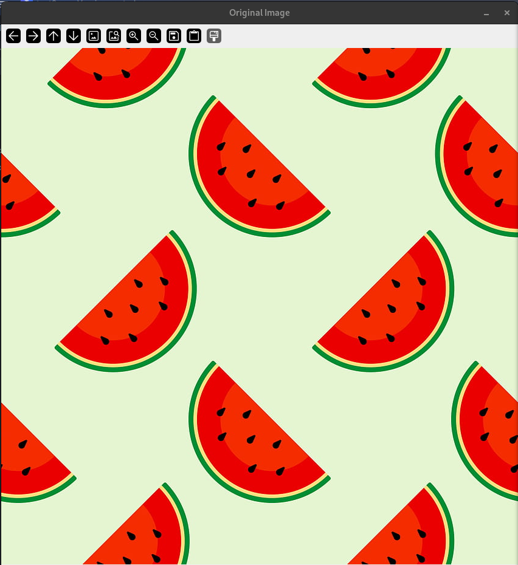
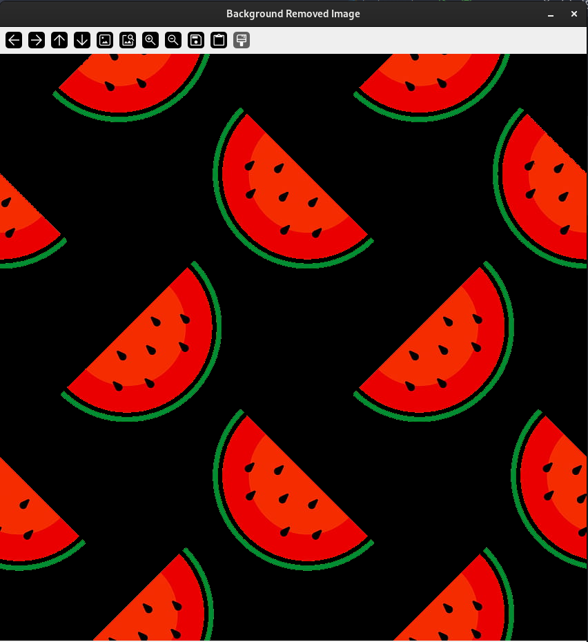

# REMOVING BACKGROUND 
    This library is a small project for removing background using OpenCV library.
    This is a test for Object-Oriented Programming (OOP).
    Explanation of code; 
    1->Takes an image as OpenCV Image and turns it to grayscale image.
    2->Method threshold for finding objects depends on black and white (values=0, 255) pixels.
    3->Takes coordinates of which one is more than another.
    4->On original image, paints black according to coordinates.
    Outputs:

### Used Libraries
  - OpenCV
  - Numpy
### Classes and Methods
- Image
    - Read
    - Get
    - Set
    - Get Original
    - Show
    - Wait Key
- Color 
    - BGR to GrayImage
- Thresh
    - Thresh Binary
    - Thresh Binary Inverted
- Background
    - Count White Dots
    - Count Black Dots
    - Coordinates White Dots
    - Coordinates Black Dots
    - Remove Background